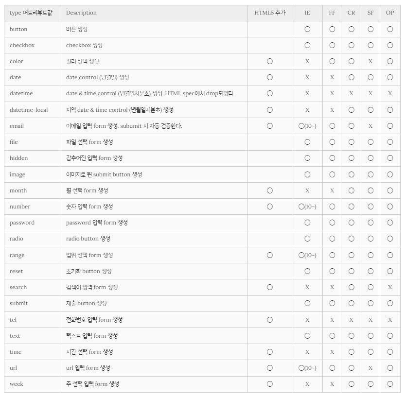

# 사용자와의 커뮤니케이션을 위한 폼 태그
## form
사용자가 입력한 데이터를 수집하기 위해 사용되며 input, textarea, button, select, checkbox, radio button, submit button 등의 입력 양식 태그를 포함할 수 있다.

|attribute|value|description|
|---------|-----|-----------|
|action|URL|입력데이터(form data)가 전송될 URL 지정|
|method|get/post| 입력데이터(form data) 전달 방식 지정|


GET과 POST는 HTTP 프로토콜을 이용해서 사용자 입력 데이터를 서버에 전달하는 방식을 나타냄
HTTP request method라고 한다.


``` markdown
GET
- GET 방식은 전송 URL에 입력 데이터를 쿼리스트링으로 보내는 방식
- 전송 URL 바로 뒤에 '?'를 통해 데이터의 시작을 알려주고, key-value형태의 데이터를 추가한다. 1개 이상의 전송 데이터는 '&'로 구분한다.
- URL에 전송 데이터가 모두 노출되기 때문에 보안에 문제가 있으며 전송할 수 있는 데이터의 한계가 있다(최대 255글자)
- REST API에서 GET메소드는 모든 또는 특정 리소스의 조회를 요청한다.
```

``` markdown
POST
- POST 방식은 Request body에 담아 보내는 방식이다.
- URL에 전송 데이터가 모두 노출되지 않지만 GET에 비해 속도가 느리다.
- REST API에서 POST 메소드는 특정 리소스의 생성을 요청한다.
```
`.//test_code/08-01_form.html` 참고

<br>

## input
input 태그는 form 태그 중에서 가장 중요한 태그로 사용자로부터 데이터를 입력받기 위해 사용된다. <br>
input 태그는 다양한 종류가 있는데 type 어트리뷰트에 의해서 구분된다. form 태그 내에 존재하여야 입력 데이터를 전송할 수 있으나 ajax를 사용할 시에는 form 태그 내에 존재하지 않아도 된다. <br>
서버에 전송되는 데이터는 name 어트리뷰트를 키로, value 어트리뷰트를 값으로 하여 key=value형태로 전송된다.




## select 
복수개의 리스트에서 복수개의 아이템을 선택할 때 사용한다.
select요소의 name 어트리뷰트를 키로, option 요소의 value 어트리뷰트를 값으로 하여 key=value의 형태로 전송

|tag|description|
|---|-----------|
|select| select form 생성|
|option| option 생성|
|optgroup| option 그룹화|

### textarea
textarea 태그는 여러줄의 글자를 입력할 때 사용한다.

### button 
button 태그는 클릭할 수 있는 버튼을 생성 <br>
`<input type="button">`과 유사하지만 input 태그는 빈 태그인 반면 button 태그는 그렇지 않다. 따라서 button 요소에는 텍스트나 이미지 같은 콘텐츠를 사용할 수 있다.

type 어트리뷰트는 반드시 지정하는 것이 바람직하며 어트리뷰트 값으로 button, reset, submit을 지정할 수 있다. 

button 태그는 어트리뷰트만을 받아들이는 input 태그와 달리 콘텐츠로 문자열은 물론 html 요소를 받을 수도 있다는 장점이 있다. <br>
※ IE의 경우 submit되는 값이 다를 수 있다.<br>
-> 오래된 IE를 지원해야 한다면 input tag를 사용하는 것이 바람직

### filedset / legend
fieldset 태그는 관련 입력 양식들을 그룹화 할 때 사용한다. legend 태그는 fieldset 태그 내에서 사용되어야 하며 그룹화된 fieldset의 제목을 정의한다.


